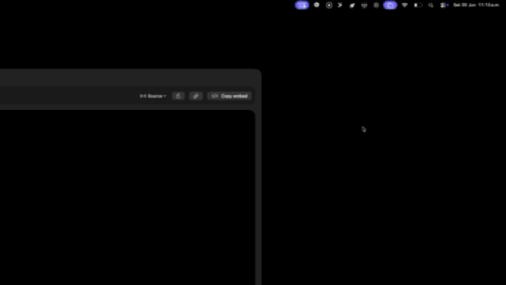

# MundialStreams

MundialStreams is a small macOS status bar app for browsing public stream sources from selectable bases:

- **CrackStreams**: reads the Soccer page and its backup server buttons.
- **TimStreams**: reads the public endpoints used by `timstreams.net`.
- **La Hinchada**: reads the public events JSON used by `lahinchada.xyz/eventos`.

The app does not host, proxy, modify, or sell any stream. It only lists links already exposed by those public pages and opens the selected source in a local macOS WebKit player.

## Download

Download the latest build from:

[GitHub Releases](https://github.com/Martifu/mundial-streams/releases/latest)

## Demo



For the full-resolution video:

[Watch the demo video](./demo%20gh.mp4)

## What The App Does

- Shows a simple `⚽️` icon in the macOS status bar.
- Opens a popup with event/source lists.
- Lets you switch between **CrackStreams**, **TimStreams**, and **La Hinchada**.
- Plays a selected source inside the popup.
- Lets you pop the player out into a separate resizable window.
- Copies either the raw source URL or an iframe embed snippet.
- Supports **Spanish**, **English**, and **Portuguese** in the app UI.

## Privacy & Transparency

There is no hidden backend in this app.

MundialStreams does **not**:

- collect personal data
- ask for login credentials
- store passwords or accounts
- inject tracking scripts
- run a background server
- upload your activity anywhere
- bundle analytics SDKs

The app does make network requests to the public sites it reads from and to the stream pages you choose to open. Those pages may load their own third-party scripts inside the WebKit player, exactly like they would in a browser.

## Network Access

The app currently reads:

- `https://crackstreams.ch/Soccer-stream/`
- the embedded CrackStreams soccer schedule page
- individual CrackStreams event pages
- `https://api.nuevasantino.xyz/api/live-upcoming`
- `https://api.nuevasantino.xyz/api/channels`
- `https://api.nuevasantino.xyz/api/replays`
- `https://lahinchada.xyz/eventos/combined_events.json`

Player windows load the specific source URL selected by the user.

## Install For Users

1. Download `MundialStreams.app` or `MundialStreams.zip`.
2. If zipped, unzip it.
3. Move `MundialStreams.app` to `Applications` if you want.
4. Open it.

If macOS blocks the app because it is not notarized:

1. Right-click `MundialStreams.app`.
2. Choose **Open**.
3. Confirm **Open** again.

If macOS still keeps the quarantine flag, run:

```bash
xattr -dr com.apple.quarantine /path/to/MundialStreams.app
```

## Build From Source

Requirements:

- macOS 14 or newer
- Apple Silicon Mac
- Xcode command line tools or Xcode

Build and run:

```bash
./script/build_and_run.sh
```

The script:

1. builds the SwiftPM target
2. stages `dist/MundialStreams.app`
3. launches the app bundle as a real macOS GUI app

## Verify What Is Inside

The app is plain Swift/SwiftUI/AppKit/WebKit code. The important files are:

- `Sources/MundialStreams/Services/CrackStreamsClient.swift`
- `Sources/MundialStreams/Services/TimStreamsClient.swift`
- `Sources/MundialStreams/Services/LaHinchadaClient.swift`
- `Sources/MundialStreams/Views/StatusPopoverView.swift`
- `Sources/MundialStreams/Support/WebStreamView.swift`

You can inspect the generated app bundle:

```bash
find dist/MundialStreams.app -maxdepth 3 -type f
codesign -dv --verbose=4 dist/MundialStreams.app
```

Current local builds are ad-hoc signed, not notarized with Apple Developer ID.

## Disclaimer

MundialStreams does not host or own any media content. It is a local viewer for links exposed by third-party websites. Use it responsibly and follow the laws and terms that apply in your location.
